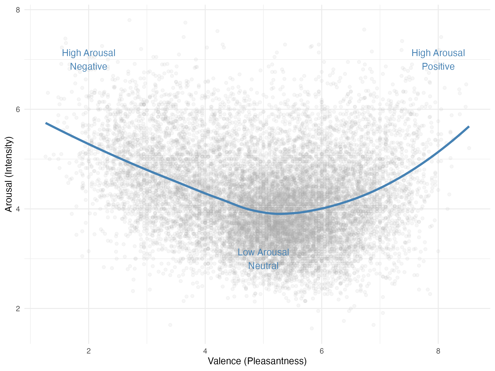
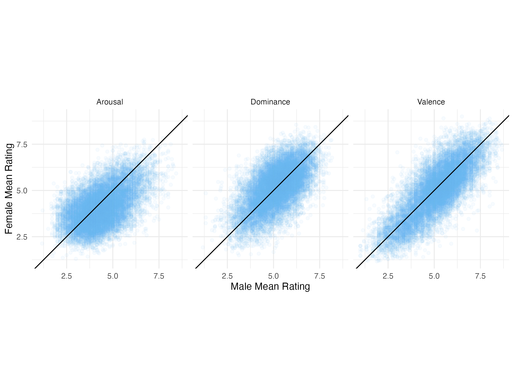

## Exploratory Data Analysis of Affective Word Norms

**Author:** Fiona Liu

### Overview

How is emotional meaning organized in the mental lexicon?

This project analyzes affective ratings for nearly 14,000 English words from the Warriner et al. (2013) norms dataset. Using R and the `tidyverse` suite, the analysis examines how valence, arousal, and dominance interact across the lexicon, how emotional judgments differ by rater gender, and how linguistic structure relates to emotional meaning.

The project combines psycholinguistics, affective science, and data science to explore large-scale patterns in human semantic representations.

### Technical Summary

* **Dataset:** 13,915 English lemmas from Warriner et al. (2013)
* **Domain:** Psycholinguistics and affective science
* **Tools:** R, `tidyverse`, `ggplot2`
* **Methods:** Exploratory data analysis, correlation analysis, demographic comparisons, and linguistic feature analysis

### Why This Matters

Understanding how emotional meaning is structured in language provides insight into human cognition, affective processing, and semantic memory. Large-scale affective norms datasets make it possible to study these questions computationally across thousands of concepts rather than through small laboratory samples.

The dataset includes human ratings on a 1–9 scale along three core emotional dimensions:

* **Valence:** The pleasantness of a word (unhappy to happy).

* **Arousal:** The intensity of emotion evoked by a word (calm to excited).

* **Dominance:** The degree of control associated with a word (controlled to in control).

### Dataset

The data used in this project comes from Warriner et al. (2013). It contains affective norms for 13,915 English lemmas collected via crowdsourcing.

* **Citation:** Warriner, A. B., Kuperman, V., & Brysbaert, M. (2013). Norms of valence, arousal, and dominance for 13,915 English lemmas. *Behavior Research Methods, 45*(4), 1191–1207. https://doi.org/10.3758/s13428-012-0314-x.
* **Source URL:** [https://link.springer.com/article/10.3758/s13428-012-0314-x](https://link.springer.com/article/10.3758/s13428-012-0314-x), located in the "Electronic supplementary material"
* **License/Access:** Data is available for academic and research use.

#### Data Dictionary (Key Variables)

| Variable | Original Name | Description |
| :--- | :--- | :--- |
| `Word` | `Word` | The English lemma rated by participants. |
| `Valence` | `V.Mean.Sum` | Mean valence rating (1 = unhappy, 9 = happy). |
| `Arousal` | `A.Mean.Sum` | Mean arousal rating (1 = calm, 9 = excited). |
| `Dominance` | `D.Mean.Sum` | Mean dominance rating (1 = controlled, 9 = in control). |
| `Valence_SD` | `V.SD.Sum` | Standard deviation of valence ratings (measure of agreement). |
| `Valence_M` | `V.Mean.M` | Mean valence rating from male participants. |
| `Valence_F` | `V.Mean.F` | Mean valence rating from female participants. |

### Key Findings

### The "Boomerang" of Intensity



Mean arousal follows a clear non-linear pattern across valence: neutral words tend to be least arousing, while highly positive and highly negative words are associated with higher arousal.

### Gender Differences in Emotional Intensity



Male participants consistently assigned higher arousal ratings than female participants across much of the lexicon, suggesting systematic differences in affective evaluation.

### Linguistic Structure and Control

Active verbs ending in `-ize` showed higher dominance ratings than abstract nouns ending in `-tion`, indicating that lexical form is associated with perceived control.

### Disagreement and Ambiguity

Words with the highest rating dispersion were concentrated around taboo terms and subjective experiences, suggesting that affective agreement decreases for semantically or socially complex concepts.

## Repository Structure

The project is organized as follows:

```plaintext
project/
│
├── data/
│   └── BRM-emot-submit.csv            # The Warriner et al. (2013) dataset
│
├── report.qmd                         # Main report: full EDA analysis and narrative
├── report.html                        # Rendered HTML version of the main report
├── executive_summary.qmd              # Standalone high-level summary of findings
├── executive_summary.html             # Rendered HTML version of the executive summary
├── 00_setup.R                         # Load packages, read data, and create summary table
├── 01_distribution_analysis.R         # Univariate distributions and Valence-Arousal pattern
├── 02_correlation_analysis.R          # Correlation heatmap
├── 03_gender_analysis.R               # Gender comparisons and outlier tables
├── 04_linguistic_analysis.R           # Suffix-based dominance comparison
├── 05_ambiguity_analysis.R            # Most ambiguous words by emotional dimension
├── run_all.R                          # Sources the analysis scripts in order
├── .gitattributes                      # Marks rendered HTML as generated on GitHub
└── README.md                          # Project documentation (this file)
```

## How to Reproduce

1.  **Clone this repository** to your local machine.
2.  Open the project in **RStudio**.
3.  Ensure the following packages are installed:
    ```r
    install.packages(c("tidyverse", "knitr", "gt", "patchwork"))
    ```
4.  Source `run_all.R` to generate the analysis objects and tables:
    ```r
    source("run_all.R")
    ```
5.  Render `report.qmd` for the full analysis, or `executive_summary.qmd` for a shorter version.

## Scripts

The analysis is split into smaller files so each section can be inspected independently:

* `00_setup.R`: loads packages, imports the data, and builds the summary table.
* `01_distribution_analysis.R`: distribution plots and the valence-arousal relationship.
* `02_correlation_analysis.R`: correlation heatmap.
* `03_gender_analysis.R`: gender comparisons and outlier tables.
* `04_linguistic_analysis.R`: suffix-based dominance comparison.
* `05_ambiguity_analysis.R`: most ambiguous words by emotional dimension.
* `run_all.R`: sources the analysis scripts in order.
